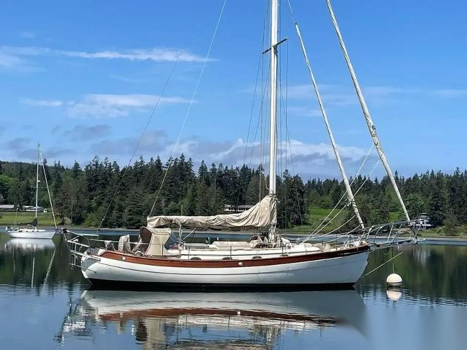

# S/V Symphony
A 1985 Hans Christian 38T; heavy displacement, cutter rigged, blue-water cruiser.
Seattle, WA is her home.

## SV Symphony IoT setup
For setting up SV Symphony's devices and computer systems.

Inspired by [meri-imperiumi/curiosity](https://github.com/meri-imperiumi/curiosity)

## Symphony — Maintenance & Improvement Tracking
Working log of deferred maintenance, in-progress
work, and planned improvements.

### Structure
- `priorities.md` — current triage: In Progress / Blocked / Backlog / Someday-Maybe. Physical boat work is tracked in Evernote instead; this file is authoritative only for the SignalK / IoT section.
- `log.md` — chronological ship's-log record, oldest entry first, real append (tail-friendly)
- `systems/` — one file per system, empty for now; populate as it makes sense
- `reference/specs.md` — vessel identity, registration, and physical particulars
- `reference/vendors-parts.md` — vendor contacts and parts sourcing

### Workflow
- Append to `log.md`; use whatever date precision is actually known (day, month, or year) — don't force false precision
- Move items between In Progress / Blocked / Backlog / Someday-Maybe in `priorities.md` as status changes; keep In Progress small
- `systems/*.md` are living reference, edited in place — git tracks the history

### Open items
- Electrical/IoT sensor and SignalK-integration tasks live in the SignalK / IoT section of `priorities.md`, separate from the physical-work items above them. Those physical items are the historical copy; Evernote is the authoritative list now, and they get pruned from here over time.
- Physical specs that also live as SignalK config (calibration curves, sensor mappings) aren't yet reconciled between this repo and the boat's running SignalK. (The "SignalK/Ansible repo" this used to point at is `tkurki/marinepi-provisioning`, which is upstream and not ours — see `reference/host_provisioning.md`.)

## Links
- [Sailboatdata — Hans Christian 38T](https://sailboatdata.com/sailboat/hans-christian-38t/)
- [Good Old Boat — Hans Christian 38T](https://goodoldboat.com/saildata/boat/hans-christian-38t/)
- [AIS — MarineTraffic](https://www.marinetraffic.com/en/ais/details/ships/shipid:9545721/mmsi:368391180/vessel:SYMPHONY)
- [AIS — VesselFinder](https://www.vesselfinder.com/vessels/details/368391180)
- [Facebook - Hans Christian Sailboats](https://www.facebook.com/hanschristiansailboats/)
