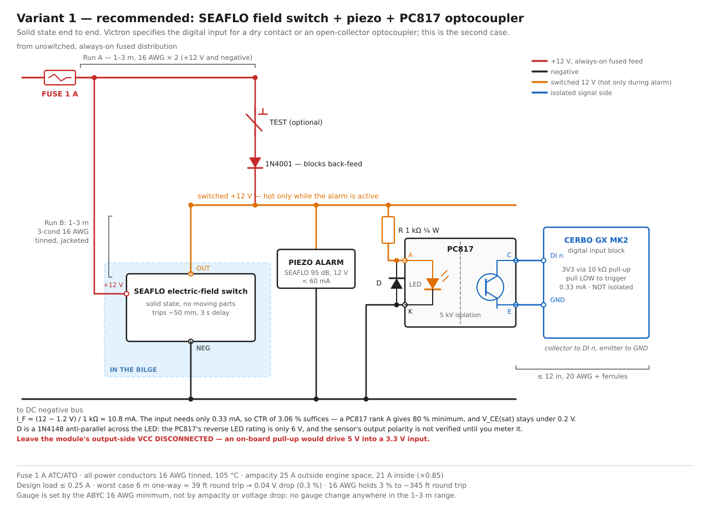
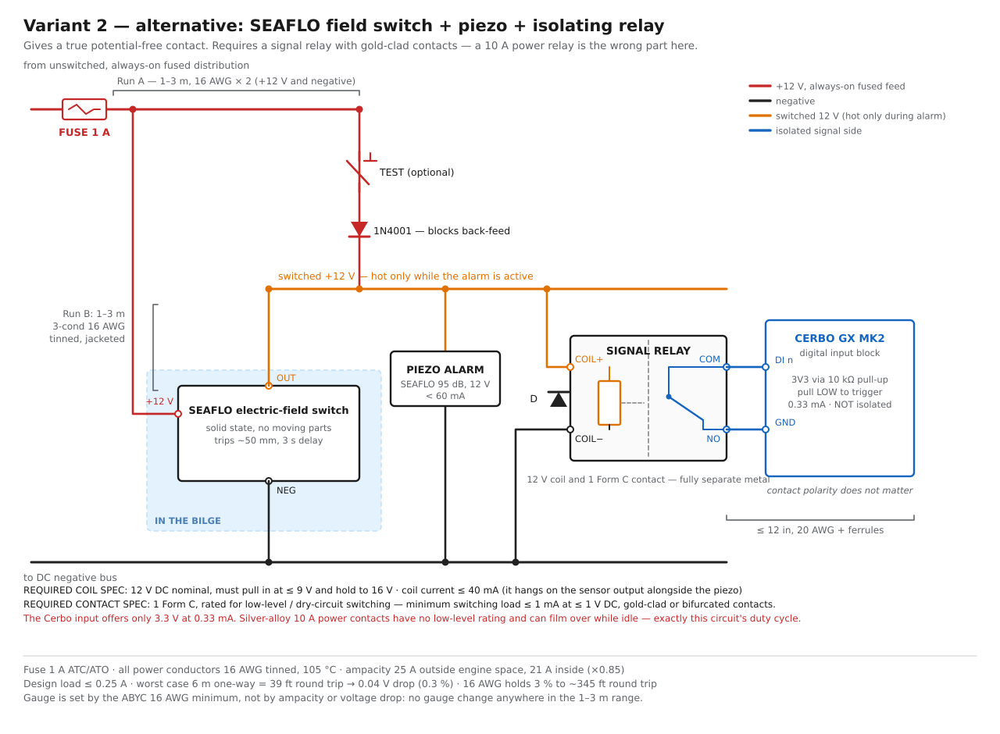
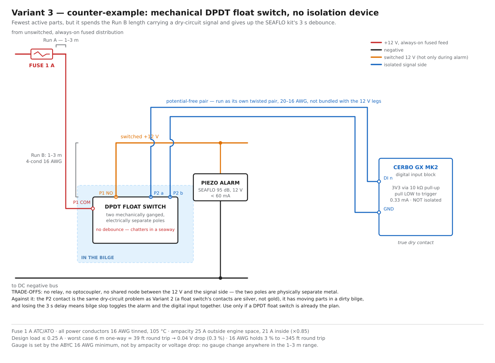
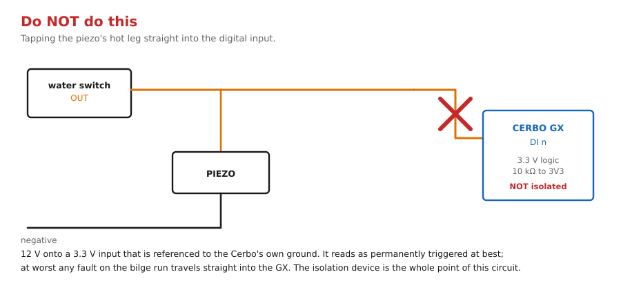

# Bilge high-water alarm — piezo + Cerbo digital input

One rising-water event has to do two things at once: sound a local piezo and
close a contact on a Cerbo GX digital input.

**Scope of this document:** from the fuse holder on an existing always-on
distribution feed, through the water switch and the piezo, to the two screws of
the Cerbo's digital-input terminal block. Nothing upstream of the fuse and
nothing downstream of that terminal block.

## Diagrams

| | |
|---|---|
| [Variant 1 — optocoupler](bilge-alarm-v1-optocoupler.svg) | recommended |
| [Variant 2 — isolating relay](bilge-alarm-v2-relay.svg) | if you want a true potential-free contact |
| [Variant 3 — mechanical DPDT float switch](bilge-alarm-v3-float-dpdt.svg) | counter-example, no isolation device |
| [Anti-pattern](bilge-alarm-antipattern.svg) | what not to wire |

Regenerate all four from the repo root:

```bash
python3 diagrams/electrical/bilge-alarm-diagrams.py
```

## The one hard constraint

The Cerbo's digital input is a 3.3 V logic pin with a 10 kΩ pull-up to 3V3,
**not galvanically isolated** — its ground is the GX's own ground. It sources
about 0.33 mA and is triggered by pulling it low. Victron specifies it for a
potential-free (dry) contact or an open-collector optocoupler, and nothing else.

Everything below follows from that: the piezo runs on 12 V, the input does not,
and the two have to be joined by something that switches without carrying the
12 V across.

## Wire and fuse sizing

Loads on the switched leg: the SEAFLO piezo (95 dB, well under 60 mA) plus
either an optocoupler LED (~11 mA) or a signal-relay coil (~10–40 mA). Design
figure **0.25 A**, which is generous by roughly 2×.

| | |
|---|---|
| Conductor | **16 AWG tinned, 105 °C insulation** — every power leg |
| Ampacity | 25 A outside engine spaces; 21 A inside (×0.85 correction) |
| Fuse | **1 A** ATC/ATO (2 A acceptable) |
| Voltage drop, worst case | 6 m one-way = 39 ft round trip → 0.04 V, **0.3 %** |
| Cerbo DI jumper | 20 AWG with bootlace ferrules, under 12 in, no fuse |

Ampacity, correction factors and the copper constant K = 10.75 are from
[mark-brannan/ampacity](https://github.com/mark-brannan/ampacity)
(`data/e11.json`, ABYC E-11 Table 6A).

**16 AWG is the ABYC minimum conductor size, not a calculated result.** Drop at
0.25 A does not reach 3 % until roughly 345 ft of round-trip conductor — about
50 m each way. So:

- No gauge changes anywhere across the stated 1–3 m range for either run.
- Total circuit length may grow to ~50 m one-way before any of this is revisited.
- Run A and Run B may each be anywhere from 1 m to 3 m in any combination.

The Cerbo DI jumper carries only the 0.33 mA the GX itself sources through its
own pull-up. It is inherently current-limited and needs no overcurrent
protection; 20 AWG is chosen to fit the terminal block's ferrules, not for
current.

The alarm belongs on an always-on, unswitched fused feed — the same category
`systems/electrical.md` already puts the bilge pumps and high-water alarm in.

## Variant 1 — SEAFLO field switch + piezo + PC817 optocoupler (recommended)



The sensor's switched output feeds the piezo and, in parallel, an optocoupler
LED through a series resistor. The optocoupler's phototransistor is the
open-collector switch on the Cerbo input: collector to `DI n`, emitter to `GND`.

Why this one: nothing mechanical anywhere in the signal path, and it is one of
the two connection types Victron specifies for the input. A circuit that sits
idle for months in a damp locker and must work the first time it is asked has no
business relying on a contact wiping through an oxide film.

Numbers:

- I_F = (12 − 1.2 V) / 1 kΩ = **10.8 mA**.
- The input needs 0.33 mA, so the required current transfer ratio is **3.3 %**.
  A PC817 rank A gives 80 % minimum. V_CE(sat) stays under 0.2 V — far below the
  input's logic-low threshold.
- Resistor dissipation 0.117 W. Use **¼ W or better**; a 1/8 W chip resistor sits
  at ~94 % of rating, which is only acceptable because it is energised solely
  during an alarm.

Required specs for the isolation device:

| | |
|---|---|
| Part | PC817 (or any 4N25/PC817-class transistor-output optocoupler) |
| LED drive | 5–20 mA at 12 V ⇒ series resistor 560 Ω – 2.2 kΩ, ≥ ¼ W |
| Reverse protection | 1N4148 anti-parallel across the LED — PC817 V_R max is only 6 V |
| Output | bare open collector: collector → `DI n`, emitter → `GND` |
| Output pull-up | **must not be powered** |

Bill of materials beyond the SEAFLO kit: one PC817, one 1 kΩ ¼ W resistor, one
1N4148, a 1 A fuse and holder, 16 AWG tinned wire, a small terminal strip. Add
optionally a momentary push-button and a 1N4001 for the test branch, which
exercises the piezo and the digital input together without filling the bilge.
The diode is there so the button cannot back-feed the sensor's output stage.

## Variant 2 — SEAFLO field switch + piezo + isolating relay



Same topology, with a relay coil in place of the optocoupler LED and the relay's
contact as a genuine potential-free pair on the Cerbo input. Contact polarity
does not matter, which is the one thing this buys over Variant 1.

Required specs:

| | |
|---|---|
| Coil | 12 V DC nominal, pull-in at ≤ 9 V, hold to 16 V |
| Coil current | ≤ 40 mA — it hangs on the sensor output alongside the piezo |
| Contact | 1 Form C (SPDT) minimum |
| Contact rating | **low-level / dry-circuit capable: minimum switching load ≤ 1 mA at ≤ 1 V DC**, gold-clad or bifurcated |
| Flyback diode | 1N4001 across the coil, **mandatory** |

The contact rating is the whole difficulty. The Cerbo offers 3.3 V at 0.33 mA —
textbook dry-circuit conditions. Silver-alloy power contacts (AgSnO₂, AgCdO) are
specified from about 100 mA at 5 V and carry no low-level rating; they rely on
the load itself to wipe the contact clean, and this circuit never provides it.
Gold-clad signal relays — Omron G5V-2, Panasonic TQ2-12V and similar — are rated
down to 1 mA at 1 V and are the correct part.

The flyback diode is not optional: the coil is being driven by a solid-state
output stage inside the SEAFLO switch, and the collapse spike will eventually
take it out.

## Variant 3 — mechanical DPDT float switch, no isolation device (counter-example)



Two mechanically ganged, electrically separate poles: pole 1 switches 12 V to
the piezo, pole 2 is the dry contact across the Cerbo input. No relay, no
optocoupler, no shared node.

Against it:

- Pole 2 is the same dry-circuit problem as Variant 2 — a float switch's
  contacts are silver, sized for pump current, not for 0.33 mA.
- Moving parts in a dirty bilge, which is the failure mode the SEAFLO
  field-effect sensor exists to avoid.
- It gives up the kit's 3-second response delay, so bilge slop in a seaway
  toggles the alarm and the digital input together.
- The signal pair now runs the full Run B length. Run it as its own twisted
  pair, not bundled with the 12 V legs.
- DPDT float switches are uncommon; most are SPST.

Worth wiring only if a DPDT float switch is already the plan for other reasons.

Note that swapping a plain SPST float switch in for the SEAFLO sensor in Variant
1 or 2 changes nothing downstream — the isolation stage is identical. The choice
of sensor and the choice of isolation device are independent.

## Anti-pattern



Tapping the piezo's hot leg straight into the digital input puts 12 V on a 3.3 V
pin referenced to the Cerbo's own ground. It reads as permanently triggered at
best; at worst any fault on the bilge run travels straight into the GX.

## On-hand parts

| Part | Verdict |
|---|---|
| "817 module" HY-M154, 4-channel PC817 | **Suitable with checks.** Meter the input series resistor: 560 Ω – 2.2 kΩ is fine at 12 V drive; below 560 Ω it overdrives the LED, and a 1/8 W part at 1 kΩ is at 94 % of rating. Use the output as a bare open collector and leave the output-side VCC disconnected — an on-board pull-up would drive 5 V into a 3.3 V input. Confirm the output stage is not inverted by an extra transistor. |
| Songle 10 A relay modules, single- and 4-channel | **Not suitable for the Cerbo contact.** The 10 A silver-alloy contacts have no low-level rating and can film over while idle. Also confirm the coil is the 12 V part (`SRD-12VDC-SL-C`) — the 5 V version is common on these boards — and that the module's logic-high/logic-low input threshold suits a 12 V drive. |
| Songle modules, other uses | Fine for switching the 12 V piezo or any real load, where the contact wipes itself clean. Not for the signal side. |
| Not on hand, worth buying | A gold-clad signal relay (Omron G5V-2-DC12, Panasonic TQ2-12V) if you want Variant 2 done properly. A bare PC817 plus a 1 kΩ ¼ W resistor costs under a dollar and is fully specified, which the module is not until it is metered. |

## Bench checks before installation

1. **Meter the SEAFLO switch's pinout.** Whether the output is high-side
   (switches +12 V to the load) or low-side (sinks the load to negative) decides
   which rail the piezo and the isolation device return to. The topology is
   identical either way — only the other end of the load moves. Verify before
   wiring rather than assuming.
2. **Meter the HY-M154's input resistor and output stage** if that module is
   used, per the table above.
3. **Verify the alarm and the digital input together** using the test button, or
   by shorting the sensor output to the appropriate rail.
