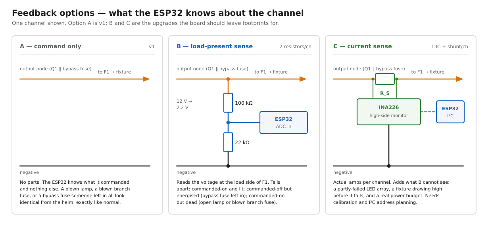

# 12 V navigation-light controller — ESP32 + optocouplers, with a manual fuse bypass

Five 12 V lighting channels switched by an ESP32 through optocouplers, each
one paralleled by a blade-fuse slot that turns the light on unconditionally
when a fuse is inserted. The electronics are the convenience; the fuse block
is what gets the boat legally lit when they fail.

**Scope of this document:** from the +12 V main run arriving at the board, to
the terminals where each fixture's pair lands. Nothing upstream of that feed —
its breaker, its switch and its own protection are treated as existing and
correct — and nothing inside the fixtures.

**Not settled here:** conductor gauge, fuse values and MOSFET part numbers.
Loads are unmeasured. Every number below marked *stand-in* is a working
placeholder chosen to make the topology concrete, not a specification.

## Diagrams

| | |
|---|---|
| [System block](nav-light-block.svg) | five channels, both fuse blocks, one ESP32 |
| [One channel in detail](nav-light-channel.svg) | gate network, optocoupler, both current paths |
| [Feedback options](nav-light-feedback.svg) | what the ESP32 can know about a channel |

Regenerate all three from the repo root:

```bash
python3 diagrams/electrical/nav-light-diagrams.py
```

## Channels

| | Channel | Fixture | Run, one-way (*stand-in*) |
|---|---|---|---|
| CH1 | Steaming light | masthead, forward-facing white 225° | 14 m |
| CH2 | Anchor light | all-round white 360° | 18 m |
| CH3 | Sidelights | port + starboard, one channel | 6 m |
| CH4 | Stern light | white 135° | 7 m |
| CH5 | Spare | brought out to terminals, uncommitted | — |

Run lengths are derived from the vessel's own particulars — 37' 11" LOA, mast
54.5 ft above DWL (`reference/specs.md`) — plus routing allowance. They are
here so the topology has something to hang on, not because anything has been
measured.

Port and starboard sidelights share one channel deliberately: they are never
shown independently, so splitting them would double the parts for no operating
case. If they are separate fixtures with separate runs, they still branch after
CH3's branch fuse.

**Stern is on the board.** Its wire run goes to the transom rather than the
mast, which is a wiring question, not a switching one. Keeping it here means
one bypass block, one ESP32, one failure surface, and the same failover story
for every light that COLREGS requires underway.

## How one channel switches

The ESP32 does not switch anything. It lights an LED inside an optocoupler;
the optocoupler's phototransistor pulls the gate of a P-channel MOSFET down
from the +12 V rail; the MOSFET connects the rail to the fixture.

The signal chain, with *stand-in* values:

| | | |
|---|---|---|
| R3 | 220 Ω | ESP32 GPIO to opto LED. (3.3 − 1.2 V) / 220 Ω = **9.5 mA** |
| R4 | 10 kΩ | GPIO pulldown |
| U1 | PC817 | or any transistor-output optocoupler |
| R1 | 100 kΩ | gate to source — holds Q1 **off** |
| R2 | 22 kΩ | gate to the opto's collector |
| D1 | 15 V zener | V_GS clamp, gate to source |
| Q1 | P-channel MOSFET | see the spec envelope below |

R1 and R2 form a divider across the bus whenever the optocoupler conducts:

- At 12.0 V: V_gate = 12 × 22 / 122 = 2.16 V, so **V_GS = −9.8 V**.
- At 14.4 V absorption: V_GS = −11.8 V.
- At 15.0 V: V_GS = −12.3 V, comfortably inside a ±20 V gate rating and
  still below D1's 15 V, so the clamp never conducts in normal operation.

The optocoupler has to sink only 12 V / 122 kΩ ≈ **98 µA**. A PC817 driven at
9.5 mA can pass several milliamps even at a badly degraded current transfer
ratio, so this stage has roughly two orders of magnitude of margin and does not
care which rank of part turns up.

Turn-off is R1 charging the gate capacitance: 100 kΩ against a few nF is on the
order of a millisecond. For lamps that is irrelevant. It matters only if a
channel is ever PWM-dimmed, which would want R1 an order of magnitude smaller
and a fresh look at the whole gate network.

### Why high-side, and why a MOSFET

Switching the +12 V leg rather than the negative leg leaves every fixture's
negative permanently bonded to the common negative bus. That matters here
because masthead fixtures often ground through mast hardware and because a
low-side switch leaves the fixture's chassis floating whenever the light is
off — an invitation to galvanic mischief and to confusing meter readings.

A MOSFET over a relay: no coil current for the hours these lights are on, no
contacts to film over in salt air, no click, and nothing mechanical at the top
of a list whose entire purpose is not failing. The cost is that a MOSFET fails
in whichever state it fails in, including shorted-on. That is the argument for
the branch fuse being a real fuse rather than the MOSFET's own protection.

### MOSFET spec envelope

Not a part number — the envelope any candidate has to clear:

| | |
|---|---|
| V_DS | ≥ 40 V; 60 V preferred, for alternator load-dump headroom |
| V_GS | ±20 V minimum |
| I_D continuous | ≥ 4× the channel's steady draw, at the case's real temperature |
| R_DS(on) | low enough that I²R at maximum load stays a small fraction of a watt |
| Inrush | must sit inside the SOA curve for the cold-filament surge if any fixture is incandescent |

Incandescent fixtures pull roughly ten times their steady current for the first
few milliseconds. LED fixtures do not, but many contain a switching converter
with an input capacitor, which produces its own brief surge. Neither is a
problem for a part sized as above; both are a problem for a part sized to the
steady current.

## The manual bypass

Each channel has a blade-fuse slot wired from the +12 V bus straight to the
channel's output node — the same node the MOSFET's drain lands on. Insert a
fuse and the light is on. Remove it and the ESP32 has control.

This is a hard parallel bypass with no diode and no interlock. Consequences,
all of them accepted deliberately:

- **With the fuse in, the ESP32 cannot turn that light off.** The manual path
  wins, always. That is the point: the recovery path must not depend on the
  thing it is recovering from.
- Both paths can conduct at once. They join the same two nodes, so this is
  harmless.
- No back-feed problem. Q1's body diode runs drain-to-source; with the output
  node held at bus voltage by the fuse, it is not forward-biased.
- **A fuse left in is invisible.** The light behaves correctly — it is on —
  and stays on when the ESP32 says off. Nothing in the v1 build detects this.
  See the feedback options.

The bypass block is a separate fuse block from the branch fuses, and it is
**normally empty**. An empty block is a much stronger visual signal than a
labelled position in a shared block, and it makes "is anything bypassed?" a
question answered by looking rather than by tracing.

### Do not use a fuse block with blown-fuse indicator LEDs

For the bypass block specifically. Those indicator LEDs sit in parallel with
each fuse position and light when the fuse is open — which, in this block, is
the normal state of every position. Each one would then trickle its indicator
current through the fixture to ground: enough to make a modern LED nav light
glow faintly, permanently, and enough to make the block look like five blown
fuses all the time. Use a plain block.

## Fusing

The main run into the board is protected at its source, per the scope above.
Two things are added here.

| | |
|---|---|
| **F-LOGIC**, 1 A (*stand-in*) | the tap feeding the ESP32's buck converter |
| **F1–F5**, per channel (*stand-in*) | branch protection, sized to each run's conductor |

The branch fuses sit **downstream of where the MOSFET and the bypass fuse
join**, so one fuse protects the run to the fixture no matter which path is
energising it. This is why there are two blocks rather than one: it is
tempting to let the bypass fuse do double duty as branch protection, but then
the electronic path — the one used every day — has no protection nearer than
the panel, and a short in the masthead wiring takes out the whole board.

The bypass fuse's own rating should match its branch fuse; there is no case
where you want the bypass path to carry more.

## What happens when things fail

| Condition | Result |
|---|---|
| ESP32 unpowered | All channels off. R1 holds every gate at its source. |
| ESP32 booting, GPIO high-impedance | All channels off. R4 holds each opto LED dark until firmware drives the pin. |
| ESP32 hung with outputs latched | Channels stay in whatever state they were commanded. Fit the bypass fuse for anything that must be lit; there is no way to force one *off* short of pulling F-LOGIC or its branch fuse. |
| Firmware crash-loops | Channels flicker with the reset cycle. Pull F-LOGIC, fit bypass fuses. |
| Optocoupler fails open | That channel off. Bypass fuse. |
| MOSFET fails open | That channel off. Bypass fuse. |
| MOSFET fails shorted | That channel permanently **on**. Pull its branch fuse; that light is out until the board is repaired. |
| Branch fuse blows | That channel off on both paths — which is correct; the fault is in the wiring, not the switch. |

Fail-safe here means fail-**off**, and that is a real choice. The alternative —
lights that default on — is wrong for two reasons: an anchor light showing
while underway is itself a COLREGS problem, not a safe default; and a design
that defaults on gives up the ability to tell "commanded on" from "stuck on."
The bypass block is the recovery, and it is deliberately a physical act.

## Isolation: what the optocoupler actually buys

Worth being straight about. The ESP32 is powered by a non-isolated buck
converter from the same 12 V bus the lights run on, so the logic ground and the
power ground are the same net. The optocoupler is therefore **not** providing
galvanic isolation as drawn.

What it does provide, all of which is real:

- Level translation from a 3.3 V GPIO to a −10 V gate drive, with no shared
  reference between them.
- A hard barrier in the failure direction that matters: a shorted gate network
  or a punctured MOSFET puts 12 V on the phototransistor's collector, not on a
  GPIO pin.
- Immunity to ground-offset noise between the board's logic section and the
  power section, which on a boat with an alternator and a windlass is not
  theoretical.

If genuine isolation is wanted — worth it only if the ESP32 ends up powered
from somewhere other than this bus — swap the buck for an isolated DC-DC module
and keep the two grounds separate all the way to a single deliberate bond. The
rest of the circuit does not change.

## Feedback options

v1 is command-only. The board should carry the footprints for B, because the
failure this design is most likely to accumulate is a bypass fuse nobody
removed.



| | Parts per channel | Detects |
|---|---|---|
| **A — command only** *(v1)* | none | nothing |
| **B — load-present sense** | 2 resistors to an ADC | open lamp, blown branch fuse, bypass fuse left in |
| **C — current sense** | shunt + INA226 to I²C | all of B, plus partial LED-array failure and actual draw |

B is the one with the best ratio here. Two resistors reading the load side of
the branch fuse turn three currently-invisible conditions into three
distinguishable states, and one of those three — a bypass fuse still fitted —
is a condition this design creates and otherwise cannot see.

C is worth it if the channel data is going into SignalK as a real power budget
rather than as a diagnostic. That is a different reason to build it, and it can
wait until there is a reason.

## Firmware, not hardware

Which combinations are legal is a firmware question. No hardware interlock:
an interlock would have to be defeatable by the bypass fuse to be safe, and
something defeatable is not an interlock.

| Mode | CH1 steaming | CH2 anchor | CH3 sidelights | CH4 stern |
|---|---|---|---|---|
| Under power | on | off | on | on |
| Under sail | off | off | on | on |
| At anchor | off | on | off | off |

The one combination worth refusing outright is anchor plus anything else.

Two GPIO details that are hardware constraints on the firmware:

- Do not use ESP32 strapping pins for these outputs. Several are sampled at
  reset and some pulse during boot; a pin that glitches high for a few
  milliseconds flashes a nav light every time the board resets.
- R4's pulldown covers the window between power-on and the first
  `pinMode`/`digitalWrite`. Firmware should still drive all five pins low as
  its first action.

## Bill of materials, per channel

Beyond the enclosure, terminals and the board itself:

| Qty | Part |
|---|---|
| 1 | P-channel MOSFET, per the envelope above |
| 1 | PC817 or equivalent transistor-output optocoupler |
| 1 | 100 kΩ resistor (R1) |
| 1 | 22 kΩ resistor (R2) |
| 1 | 220 Ω resistor (R3) |
| 1 | 10 kΩ resistor (R4) |
| 1 | 15 V zener (D1) |
| 1 | ATC/ATO fuse position, branch |
| 1 | ATC/ATO fuse position, bypass |
| — | *option B:* 100 kΩ + 22 kΩ to an ADC pin |

Shared across the board: the ESP32, a 12 V → 5 V buck converter, F-LOGIC and
its holder, a bus bar, and a TVS across the board's 12 V input.

## Open questions

- **Is CH1 a steaming light or a masthead tricolour?** The circuit is identical
  either way; only the mode table changes. A tricolour is mutually exclusive
  with CH3 and CH4 rather than complementary to them.
- Load type per fixture — incandescent or LED — which decides whether the
  inrush line in the MOSFET envelope binds.
- Whether the ESP32 is dedicated to this board or already carries other
  sensors, which decides whether the GPIO-strapping constraint is a free choice
  or a scheduling problem.
